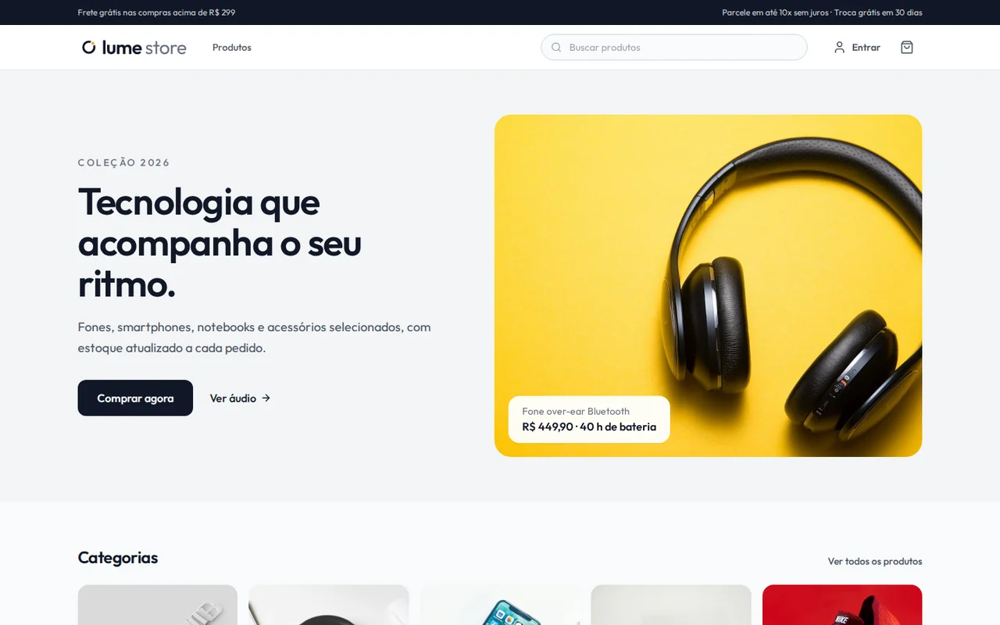
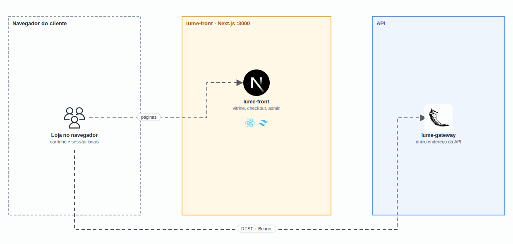

<p align="center">
  <picture>
    <source media="(prefers-color-scheme: dark)" srcset="docs/logo-dark.svg" />
    
  </picture>
</p>

<h1 align="center">
  Lume Store · Front
</h1>

<p align="center">
  
</p>

<p align="center">
  <a href="https://skillicons.dev">
    
  </a>
</p>

## Qual a finalidade do projeto?

Loja online da **Lume Store**, para tecnologia e estilo: smartphones, notebooks, áudio, acessórios e moda. O cliente navega pelo catálogo, busca e filtra por categoria, monta o carrinho, fecha o pedido e acompanha as compras. O administrador gerencia os produtos e o status dos pedidos pelo painel.

O front conversa só com o [lume-gateway](https://github.com/lume-store-org/lume-gateway), que distribui as chamadas entre os microserviços de usuários, catálogo e pedidos.

## Arquitetura

<p align="center">
  
</p>

## O que foi construído

### Páginas

| Rota | Descrição |
|---|---|
| `/` | Home com destaque, categorias com foto e mais vendidos |
| `/produtos` | Catálogo com busca, filtro por categoria e ordenação por preço |
| `/produtos/[id]` | Página do produto com estoque e quantidade |
| `/carrinho` | Carrinho com cálculo de frete grátis acima de R$ 299 |
| `/checkout` | Endereço de entrega e confirmação do pedido |
| `/pedidos` | Histórico com status e cancelamento |
| `/login`, `/cadastro` | Autenticação |
| `/conta` | Dados pessoais e troca de senha |
| `/admin` | Indicadores, produtos (criar, editar, remover) e status dos pedidos |

### Identidade visual

| Item | Valor |
|---|---|
| Marca | Órbita: anel com um ponto de luz (`public/marca/`) |
| Cores | Grafite `#111827`, âmbar `#F5A524`, névoa `#E5E7EB` |
| Tipografia | Outfit (empacotada via Fontsource, sem depender do Google Fonts no build) |
| Ícones | Lucide |

## Tecnologias utilizadas

- **Next.js 14 (App Router) + React 18 + TypeScript**;
- **Tailwind CSS:** estilos e paleta da marca;
- **Zustand:** sessão e carrinho, persistidos no navegador;
- **Lucide:** ícones;
- **Docker:** build `standalone` em duas etapas, rodando sem root.

## Estrutura do repositório

```text
lume-front/
├── src/
│   ├── app/            # Páginas (URLs em português)
│   ├── components/     # Header, ProductCard, OrderCard, OrderSummary…
│   └── lib/            # Cliente da API, stores, tipos e formatação
├── public/
│   ├── marca/          # Logo e símbolo
│   └── produtos/       # Fotos do catálogo (Unsplash)
├── docs/               # Logo, demo e diagrama
├── Dockerfile
└── README.md
```

## Fluxo de funcionamento

1. As páginas buscam os dados no gateway (`NEXT_PUBLIC_API_URL`, padrão `http://localhost:5000`).
2. O login devolve um token de sessão, guardado no navegador e enviado como `Bearer` nas chamadas privadas.
3. O carrinho fica no navegador. No checkout, o front envia só os produtos e as quantidades; o preço é definido pelo catálogo no servidor.
4. Sessão expirada (401) desloga o usuário automaticamente.

## Como rodar

A stack completa sobe pelo [lume-infra](https://github.com/lume-store-org/lume-infra).

Só o front, apontando para um gateway já no ar:

```bash
cp .env.example .env.local
npm install
npm run dev              # http://localhost:3000
```

Contas de teste: `cliente@lumestore.dev` / `senha123` e `admin@lumestore.dev` / `admin123`.

## Como validar a entrega

- Cliente: buscar um produto, adicionar ao carrinho, fechar o pedido e vê-lo em **Meus pedidos**;
- Cancelar um pedido pendente e ver o estoque voltar;
- Admin: cadastrar e editar um produto e mudar o status de um pedido no **Painel**;
- `npm run build` sem erros de tipo.

## Créditos

Fotos dos produtos: [Unsplash](https://unsplash.com) (licença Unsplash).

## Projeto Lume Store

| Repositório | Camada |
|---|---|
| [lume-front](https://github.com/lume-store-org/lume-front) | Loja (Next.js) |
| [lume-gateway](https://github.com/lume-store-org/lume-gateway) | API Gateway (Flask) |
| [lume-users](https://github.com/lume-store-org/lume-users) | Microserviço de usuários |
| [lume-catalog](https://github.com/lume-store-org/lume-catalog) | Microserviço de catálogo |
| [lume-orders](https://github.com/lume-store-org/lume-orders) | Microserviço de pedidos |
| [lume-infra](https://github.com/lume-store-org/lume-infra) | Docker Compose com a stack completa |

## Autor

**William Alves Coelho** · [@willtechdev](https://github.com/willtechdev)
